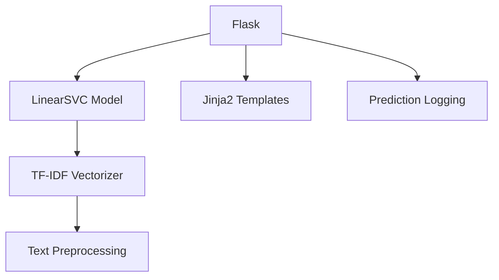
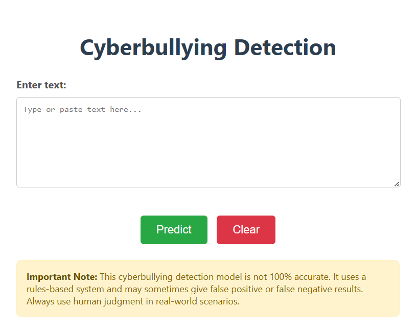

# Cyberbullying Detection WebApp

A Flask based Web application that detects cyberbullying in text using a previously trained ML model (trained on [Cyberbullying Classification Dataset](https://www.kaggle.com/datasets/andrewmvd/cyberbullying-classification)).

## 📌 Overview
This Flask-based web application uses a pre-trained LinearSVC machine learning model with TF-IDF vectorization to detect cyberbullying in text input. Users can submit text, and the system analyzes it to predict whether it contains harmful or bullying content.

## 🚀 Features
- **Real-time text analysis**
- **User-friendly interface** with text input and results display
- **Six-category classification**:
  - 👴 Age-based
  - 🌍 Ethnicity-based
  - ⚧️ Gender-based
  - 🕌 Religion-based
  - 💢 Other cyberbullying
  - ✅ Not cyberbullying
- **Audit logging** of all predictions
- **Responsive design** for all devices
  
## 🛠 Prerequisites
- Python 3.7+
- Flask (pip install flask)
- Scikit-learn (pip install scikit-learn)

Other dependencies: pandas, numpy, joblib (for model loading)

## License

This project is licensed under the MIT License - see the [LICENSE](LICENSE) file for details..

## Acknowledgments
- Thanks to all contributors who have helped make this project possible
- Special thanks to the open-source community for their invaluable tools and libraries
